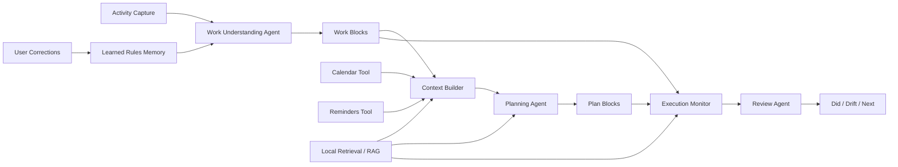

# Trace

Trace is a local-first AI work replay and planning agent for macOS knowledge workers.

It does not replace Calendar, Reminders, Notion, or task management tools. Instead, Trace acts as an agentic interpretation layer on top of existing work habits: it captures what actually happened, compresses noisy activity signals into readable work blocks, compares actual work with lightweight planning context, generates explainable next-step suggestions, and helps the user review what to adjust next.

## For Product Reviewers

This repository is structured as a product management showcase, not only a code demo.

Start here:

- [Product Review Brief](PRODUCT_REVIEW.md) - the fastest overview of the product judgment, scope, and AI PM signal
- [Portfolio Case Study EN](docs/portfolio-case-study-en.md) - full senior PM case study
- [AI Agent System Design EN](docs/ai-agent-system-design-en.md) - agent workflow, RAG, memory, tool use, fallback, and evaluation
- [Product Decisions EN](docs/product-decisions-en.md) - key tradeoffs behind the product
- [中文作品集案例](docs/portfolio-case-study-cn.md)
- [AI Agent 系统设计中文](docs/ai-agent-system-design.md)
- [产品决策中文](docs/product-decisions-cn.md)

What this project is designed to demonstrate:

- ambiguous problem framing and product boundary definition
- AI agent product design beyond a chatbot wrapper
- RAG, memory, tool use, human correction, and fallback design
- local-first privacy and trust decisions
- technical product judgment for macOS system constraints
- roadmap thinking from beta reliability to agent quality evaluation

## Product Positioning

Trace is designed around one question:

> What did I actually work on today, how did it compare with my plan, and what should I adjust next?

The product is intentionally lightweight:

- No full task management system
- No full calendar replacement
- No team workflow in the current scope
- No Windows version in the current scope
- No deep third-party PM-tool integration in the current scope

The strategic choice is to become the factual layer, interpretation layer, and planning assistance layer for an existing personal work system.

## Target Users

Trace is built for individual macOS knowledge workers who:

- already use Calendar and Reminders
- switch frequently across apps, browser tabs, documents, chats, and coding tools
- dislike manual timer-based tracking
- want a reliable work replay instead of raw activity logs
- need plan-vs-actual reflection without adopting another heavy productivity system

## Core Agent Flow



## Core Features

### Today

Shows what is happening today:

- live tracking state
- captured work time
- focus ratio
- planned coverage
- key work blocks
- unplanned and low-value blocks
- remaining-day planning suggestions

### Timeline

Turns raw activity records into a reviewable timeline:

- aggregated work blocks instead of raw event noise
- editable title, category, activity type, context, and time
- manual linking to Calendar or Reminders context
- correction feedback that improves later recognition

### Review

Helps users understand longer-term work patterns:

- today / this week / last week / last 30 days
- category distribution
- focus and drift analysis
- fragmentation signals
- structured AI summary: what happened, what drifted, what to do next

### Settings

Controls the data sources and rules that affect replay quality:

- tracking preferences
- Calendar sync
- Reminders context
- ignored applications
- AI summary settings
- learned rules

## AI Agent Design

Trace is not a chatbot and not just an LLM summary wrapper. Its agent system includes:

- activity signal collection
- work understanding and semantic work-block aggregation
- Calendar / Reminders context alignment
- local retrieval / RAG for grounding suggestions in historical work blocks, reminders, calendar constraints, and learned rules
- planning suggestions with next action, prep hint, energy level, and priority reason
- execution monitoring against actual work blocks
- review generation with did / drift / next
- user correction and learned local rules
- fallback behavior when AI or system context is unavailable

## Implementation Status

| Area | Status | Evidence in repo |
|---|---|---|
| macOS desktop app shell | Implemented beta | `src-tauri/`, `src/App.tsx` |
| activity capture and work-block aggregation | Implemented beta | `src-tauri/src/watcher/`, `src/utils/workblocks.ts` |
| Calendar and Reminders context | Implemented beta | `src-tauri/src/calendar.rs`, `src/services/ipc/` |
| Today planning flow | Implemented beta | `src/pages/Today.tsx`, `src/utils/planning.ts` |
| Timeline correction loop | Implemented beta | `src/pages/Timeline.tsx`, learned rules data model |
| Review summaries and drift analysis | Implemented beta | `src/pages/Review.tsx` |
| local AI summary flow | Implemented beta with fallback | `src-tauri/src/main.rs`, `src/services/dataService.ts` |
| RAG grounding layer | Product design / roadmap | `docs/ai-agent-system-design-en.md`, `docs/product-decisions-en.md` |
| agent quality evaluation metrics | Product design / roadmap | `docs/portfolio-case-study-en.md` |

This distinction is intentional: the showcase separates implemented beta capabilities from designed agent roadmap items to keep the product case credible.

## Technical Overview

Trace is a local-first Tauri desktop app.

- Frontend: React + TypeScript
- Desktop runtime: Tauri
- Local data: app config/data files
- System context: macOS Calendar and Reminders
- AI summary: local model flow where available, with conservative fallback behavior

Local data includes:

- `settings.json`
- `activities_YYYY-MM-DD.json`
- `learned_rules.json`

Trace writes aggregated work blocks into a dedicated Calendar and avoids overwriting user-edited Calendar events where possible.

## Local Development

```bash
npm install
npm run tauri dev
```

## Verification

```bash
npm run build
cd src-tauri && cargo check
cd src-tauri && cargo test
```
