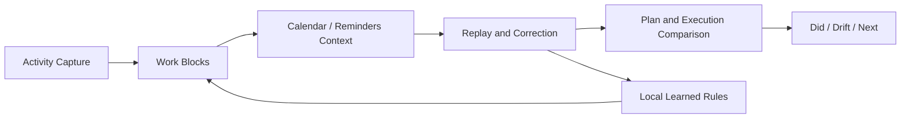

# Trace

Trace is a local-first AI work replay and planning assistant for macOS knowledge workers.

It captures device activity, compresses noisy signals into correctable work blocks, aligns actual work with Calendar and Reminders, and helps users decide what to adjust next. It is designed as an interpretation layer above existing tools—not another task-management system.

> Portfolio note: this repository separates implemented beta capability, designed roadmap, and unvalidated hypotheses. It does not present planned RAG or evaluation work as shipped results.

## Start Here

### English

1. [Product Case Study](docs/portfolio-case-study-en.md) — problem framing, strategy, scope, product loop, trust, implementation evidence, and evaluation
2. [AI Agent System Design](docs/ai-agent-system-design-en.md) — agent loop, tools, memory, RAG, contracts, fallback, and release gates
3. [Product Decision Log](docs/product-decisions-en.md) — concise record of the most important trade-offs

### 中文

1. [产品案例](docs/portfolio-case-study-cn.md) — 问题定义、战略、范围、核心闭环、信任、实现证据与评估
2. [AI 智能体系统设计](docs/ai-agent-system-design.md) — Agent 循环、工具、记忆、RAG、输出契约、回退与上线门槛
3. [产品决策记录](docs/product-decisions-cn.md) — 核心取舍的简明记录

Recommended review path:

- **5 minutes:** Case Study sections 01, 04, 09, and 12
- **10–15 minutes:** full Case Study
- **Technical AI PM review:** Agent System Design and linked implementation evidence

## Product Thesis

Knowledge workers already have tools that record plans and events. The missing layer is a trustworthy way to connect what was planned with what actually happened.

Trace answers:

1. What did I actually work on?
2. How did execution differ from my plan?
3. What is the most useful thing to advance next?

## Core Loop



## Product Scope

**In scope**

- Individual macOS knowledge workers
- Automatic activity capture and semantic work blocks
- Calendar and Reminders context
- Today, Timeline, Review, and Settings workflows
- Local AI plan/review generation with deterministic fallback
- User correction and resettable learned rules

**Not in current scope**

- Team monitoring or timesheets
- Full task/calendar replacement
- Windows or mobile clients
- Silent control of external tools
- Shipped vector retrieval/RAG

## Implementation Status

| Capability | Status | Evidence |
|---|---|---|
| macOS desktop app and activity capture | Implemented beta | `src-tauri/`, `src-tauri/src/watcher/` |
| Work-block aggregation and context matching | Implemented beta | `src/utils/workblocks.ts` |
| Calendar and Reminders context | Implemented beta | `src-tauri/src/calendar.rs`, `src/services/ipc/` |
| Planning and deterministic fallback | Implemented beta | `src/utils/planning.ts`, `src/pages/Today.tsx` |
| Correction and learned rules | Implemented beta | `src/pages/Timeline.tsx`, `src-tauri/src/main.rs` |
| Review and drift analysis | Implemented beta | `src/pages/Review.tsx`, `src/pages/Analytics.tsx` |
| Local AI summary | Beta with fallback | `src-tauri/src/main.rs` |
| Vector retrieval/RAG | Designed, not implemented | `docs/ai-agent-system-design-en.md` |
| Full offline agent evaluation set | Planned | Current base: `scripts/run-workblock-validations.ts` |

## Technical Overview

- Frontend: React + TypeScript
- Desktop runtime: Tauri
- Native context: macOS activity, Calendar, and Reminders
- Local data: application data and configuration files
- AI: local model where available, with deterministic fallback

## Local Development

```bash
npm install
npm run tauri dev
```

## Verification

```bash
npm run validate:logic
npm run build
cd src-tauri && cargo check && cargo test
```
