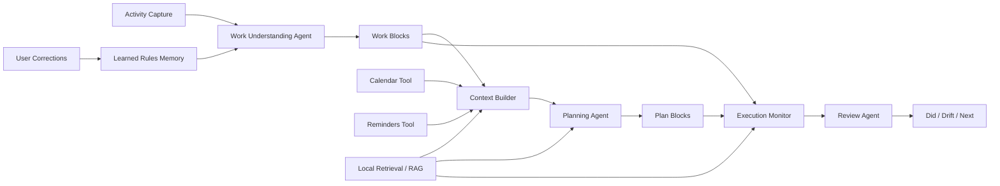

# Trace AI Agent System Design

Trace's agent is not a chatbot. It is a personal work-understanding agent embedded into the work replay and plan-comparison flow.

## 1. Agent Goal

> Based on real activity, Calendar, Reminders, historical work blocks, retrieved context, and user corrections, determine the user's current plan execution state, generate explainable remaining-day plans, and surface drift and next actions during review.

## 2. Agent Architecture

## 3. Agent Capabilities

| Agent | Responsibility | Input | Output | Risk control |
|---|---|---|---|---|
| Work Understanding Agent | Understand what window activity represents | app, window title, duration, learned rules, retrieved similar blocks | work block, category, activity type, context key | rule fallback, user correction |
| Context Builder | Read planning and schedule context | Calendar, Reminders, activity history, retrieved context | calendar events, incomplete reminders, warnings | cache, timeout fallback |
| Retrieval / RAG Layer | Retrieve similar work blocks, reminders, calendar events, and correction rules | query context, work blocks, rules, summaries | grounded evidence, similar blocks, source references | top-k limit, low-confidence fallback |
| Planning Agent | Generate remaining-day plans | incomplete reminders, free time, work momentum, RAG evidence | plan blocks, next action, prep hint, energy, priority reason | fallback plan, editable output |
| Execution Monitor | Determine whether a plan was advanced | plan blocks, actual work blocks, semantic match | completed, progressing, started, not started, drifted | show evidence, allow manual linking |
| Review Agent | Generate review summary | digest metrics, drift, context warnings, recent summaries | did, drift, next | structured output, cache |

## 4. Tools

| Tool | Purpose | Product principle |
|---|---|---|
| macOS activity tracking | Capture real behavior | Facts first; do not rely on subjective memory |
| Calendar | Read schedule constraints and optionally write plan / replay blocks | Do not replace Calendar |
| Reminders | Read original task intent | Do not replace the task system |
| local activity history | Understand today's work momentum | Preserve context and reduce switching |
| local retrieval / RAG | Retrieve similar work blocks, reminders, calendar constraints, and correction rules | Ground outputs in evidence, not generic generation |
| learned rules | Reuse user corrections | Explainable and resettable |
| local AI summary | Generate review text | Must not block core functionality |

## 5. Memory

### Short-term context

- Today's activity records
- Current work blocks
- Today's Calendar events
- Incomplete Reminders
- Current daily plan
- Review cache

### Long-term local memory

- learned rules
- corrected categories
- corrected context keys
- manual Reminder links
- manual Calendar links
- ignored applications
- category rules

## 6. RAG / Context Grounding

Trace uses RAG not for generic Q&A, but to ground agent decisions in the user's own work evidence.

| Retrieval source | Used by | Purpose |
|---|---|---|
| historical work blocks | Work Understanding Agent, Execution Monitor | Match similar apps, window titles, project keywords, and context keys |
| Reminders | Planning Agent | Determine source task, priority, and whether work has progressed |
| Calendar events | Planning Agent, Context Builder | Avoid conflicts with fixed schedule constraints |
| learned rules | Work Understanding Agent | Reuse corrected categories and relationships |
| recent review summaries | Review Agent | Avoid repetitive reviews and identify active themes and repeated drift |

RAG output should include:

- retrieved item type
- source title
- matched reason
- confidence
- how it influenced the agent output

Risk controls:

- Do not put all raw events into the prompt.
- Limit retrieval to top-k evidence.
- Fall back to rules, explicit Calendar / Reminders context, and correction UI when evidence is weak.
- Show evidence for important recommendations to avoid black-box planning.

## 7. Planning Agent Output Schema

| Field | Meaning |
|---|---|
| title | Plan block title |
| startTime / endTime | Suggested execution time |
| durationMinutes | Estimated duration |
| sourceReminder | Source reminder |
| confidence | Confidence level |
| rationale | Why this item is suggested |
| nextAction | Smallest next action |
| prepHint | Preparation needed before starting |
| energy | High-focus / medium-focus / low-pressure |
| priorityReason | Ranking reason |
| evidence | Source Reminder, Calendar constraint, or similar historical work block |

## 8. Execution States

| State | Meaning |
|---|---|
| Completed | Actual matched time is close to planned time |
| Progressing | Related work has clearly progressed but is not complete |
| Started | Some related work exists |
| Not started | No related work is detected |
| Drifted | Planned time arrived but actual work was clearly unrelated |

## 9. Evaluation

| Metric | Why it matters |
|---|---|
| work-block aggregation accuracy | Measures whether the Work Understanding Agent is trustworthy |
| reminder/calendar match precision | Measures whether Context Builder is trustworthy |
| plan suggestion adoption rate | Measures whether Planning Agent is useful |
| plan execution match rate | Measures whether suggestions turn into action |
| manual correction rate | Measures AI misinterpretation cost |
| repeated correction reduction | Measures whether memory is effective |
| retrieval hit rate | Measures whether RAG finds useful context |
| citation / evidence precision | Measures whether evidence actually supports the output |
| low-confidence fallback rate | Measures whether the agent avoids over-automation when evidence is weak |
| fallback trigger rate | Measures tool and AI stability |

## 10. Product Principle

The agent should not optimize for full automation or silent takeover. Trace's agent should be:

- context-aware
- tool-using
- memory-backed
- retrieval-grounded
- correctable
- explainable
- low-friction
- local-first

Its value is not making every decision for the user. Its value is helping the user see facts faster, repeat fewer corrections, and move into the next action more easily.
