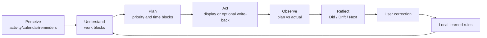

# Trace AI Agent System Design

This document is the technical product appendix to the Trace case study. It covers the agent loop, tools, memory, RAG, output contracts, failure fallback, and evaluation, while explicitly separating the **current beta** from the **designed roadmap**.

## 1. Product Goal and Boundary

> Use real activity, Calendar, Reminders, and user corrections to create explainable work replay, assess plan progress, and propose limited next actions.

The agent does not:

- maintain a complete task system for the user
- guess user intent when evidence is weak
- silently overwrite user changes
- replace the main workflow with chat
- block the product when a model is unavailable

## 2. Capability Status

| Capability layer | Beta status | Notes |
|---|---|---|
| Activity perception | Implemented | macOS active window, duration, and system state |
| Work understanding | Implemented | Rule, semantic-field, context-key, and learned-rule aggregation |
| Context tools | Implemented | Calendar, Reminders, and activity history |
| Planning agent | Implemented beta | Deterministic plan plus optional local-model structured plan |
| Execution monitoring | Implemented beta | Plan-block and actual-work-block comparison |
| Review | Implemented beta | Metrics, drift, structured local-model summary, and fallback |
| User memory | Basic implementation | Visible and resettable learned rules |
| Vector retrieval/RAG | Designed, not implemented | Planned local indexing of historical evidence |
| Agent evaluation set | Metrics defined | Requires labeled examples and regression baselines |

## 3. Agent Loop



This loop captures the agentic behavior: continuously reading the environment, using tools, producing structured action, observing outcomes, and adapting through user feedback. It is not a one-shot prompt call.

## 4. Components and Responsibilities

| Component | Input | Output | Current mechanism | Risk control |
|---|---|---|---|---|
| Activity perception | app, window, time, heartbeat | raw activity | local macOS capture | permission state, sleep/wake handling |
| Work understanding | raw activity, rules, corrections | work block, category, context key | deterministic aggregation and rules | editable, unlinkable |
| Context builder | Calendar, Reminders, history | schedule, tasks, warnings | native-tool read and cache | timeout, cache, health state |
| Planning agent | free time, tasks, momentum | plan blocks and rationale | rule scheduling + optional local model | JSON parsing, deterministic fallback |
| Execution monitor | plan blocks, actual blocks | execution state | time and semantic matching | evidence display, manual linking |
| Review | digest, drift, warnings | Did / Drift / Next | template + local model | cache, structured fallback |

## 5. Tool Use

| Tool | Agent use | Failure mode | Fallback |
|---|---|---|---|
| Activity tracking | Capture real behavior | permission off, process interruption | show state; do not fabricate records |
| Calendar | Read constraints, optionally write back | denial, timeout, conflict | cache, retry, protect user edits |
| Reminders | Read original plan intent | permission/list unavailable | use available context and show warning |
| Local activity history | Infer momentum and execution | insufficient data | lower confidence |
| Learned rules | Reuse user correction | incorrect rule accumulation | visible, deletable, resettable |
| Local model | Generate structured plans and reviews | absent, timeout, invalid format | deterministic plan and template summary |
| Local retrieval/RAG | Retrieve historical evidence | **not implemented** | explicit context and rules |

## 6. Memory Design

Trace does not use open-ended "chat memory." It stores explainable local state tied directly to product tasks.

### Short-term context

- current-day activity and work blocks
- current-day Calendar events
- incomplete Reminders
- current plan suggestions and execution state
- review cache for the selected period

### Long-term local state

- corrected categories and context keys
- manually linked/unlinked Calendar events and Reminders
- ignored applications
- category rules
- model and data-source settings

### Memory-write principles

1. Learn only from explicit correction or stable settings.
2. Never promote a single model inference into a long-term fact.
3. Keep rules visible, resettable, and deletable.
4. Ask for confirmation when rules conflict rather than overwrite silently.

## 7. RAG / Context Grounding Design

**Status: designed; vector indexing is not implemented in the current beta.**

RAG is not intended for generic Q&A. It is designed to ground work understanding, planning, and review in the user's own evidence.

| Retrieval object | Consumer | Purpose |
|---|---|---|
| Similar historical work blocks | Work understanding, execution monitor | Infer project and work semantics |
| Reminders | Planning agent | Ground task source and priority |
| Calendar events | Context builder, planning agent | Identify fixed constraints |
| Learned rules | Work understanding | Reuse user-confirmed semantics |
| Recent review summaries | Review | Identify repeated drift and longer-term themes |

Each retrieved item should include at least:

```json
{
  "sourceType": "work_block",
  "sourceId": "local-id",
  "title": "Trace case study",
  "matchedReason": "same project and window-title tokens",
  "score": 0.82,
  "timestamp": "local timestamp"
}
```

### RAG quality gates

- Filter by permission and time scope before similarity ranking
- Limit top-k rather than placing raw history into the prompt
- Show source and match reason for important recommendations
- Do not cite evidence below the threshold
- Fall back to explicit Calendar/Reminders context and rules when retrieval fails

## 8. Planning Agent Output Contract

Planning output must be structured; the UI must not depend on free-form prose.

```json
{
  "summary": "Continue the current workstream before lower-pressure tasks.",
  "blocks": [
    {
      "title": "Improve the product case",
      "startTime": "14:00",
      "endTime": "15:00",
      "sourceReminder": "Update portfolio",
      "confidence": "high",
      "rationale": "The same project already has momentum today.",
      "nextAction": "Complete the problem and evaluation sections.",
      "prepHint": "Open the case document and implementation-status table.",
      "energy": "high_focus",
      "priorityReason": "Directly related to the current delivery goal.",
      "evidence": []
    }
  ]
}
```

### Output validation

- Times must parse and avoid fixed schedule conflicts
- Duration must remain inside allowed bounds
- Source task must come from retrieved context or be marked as a system suggestion
- Confidence must be consistent with evidence strength
- Parsing failure discards model output and activates deterministic planning

## 9. Execution States

| State | Decision |
|---|---|
| Completed | Actual matched time is close to planned time |
| Progressing | Related work is substantial but below planned time |
| Started | Only a small amount of related work exists |
| Not started | No related work exists |
| Drifted | Clearly unrelated work appears during planned time |
| Unknown | Data or evidence is insufficient |

Unknown is necessary; it prevents the system from presenting uncertainty as drift.

## 10. Failure Modes and Safe Fallback

| Failure mode | User risk | Product response |
|---|---|---|
| Different tasks merged | Inaccurate replay | Split/edit entry and rule learning |
| Wrong plan link | Misleading review | Show source and support link/unlink |
| Generic model advice | Loss of trust | Require a concrete next action and rationale |
| Invalid model format | Broken page | Schema validation and deterministic fallback |
| Permission/tool failure | Missing data | Explicit warning; never fabricate completeness |
| Over-memory | Persistent error amplification | Learn only explicit correction; allow reset |
| Wrong RAG evidence | Incorrectly reinforced judgment | Threshold, source display, no-evidence fallback |

## 11. Evaluation Design

### Offline set

Build anonymized or synthetic scenarios covering:

- one task across multiple applications
- similar window titles from different projects
- Calendar and actual activity conflict
- partially advanced Reminder
- manual unlink that must not auto-link again
- absent local model or invalid JSON
- sleep/wake and long idle periods
- empty, conflicting, or low-relevance retrieval

### Core metrics

| Layer | Metrics |
|---|---|
| Understanding | work-block boundary F1, category accuracy, false-merge rate |
| Linking | Calendar/Reminders match precision, incorrect auto-link rate |
| Planning | suggestion adoption, execution match, suggestion edit rate |
| Trust | correction rate, repeated-correction reduction, unsupported-advice rate |
| RAG | Recall@k, evidence precision, citation support rate |
| Reliability | tool failure, fallback success, model parse failure |

### Release gates

Before expanding proactive capability, prove that:

1. Core tasks remain usable with the model disabled.
2. Automatic linking optimizes for precision before coverage.
3. User correction reduces repeated errors.
4. Low-confidence cases correctly enter Unknown or confirmation.
5. RAG increases grounded recommendations without increasing unsupported citations.

## 12. Product Principles

The Trace agent should:

- use tools without silently taking them over
- use memory while storing only explainable facts
- use generation while preserving deterministic fallback
- use RAG without treating similarity as truth
- provide recommendations with evidence and confidence
- state uncertainty when it does not know

Its value is not making every decision for the user. Its value is helping the user see facts faster, repeat fewer corrections, and move into the next action more easily.
