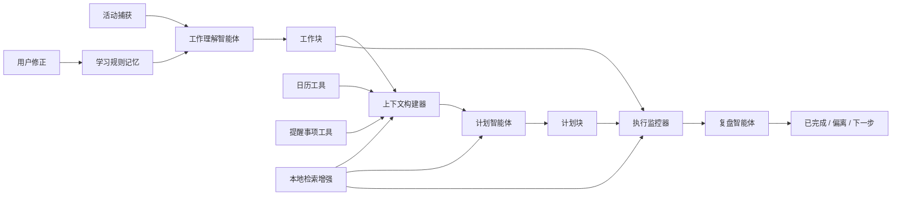

# Trace AI 智能体系统设计

Trace 的智能体不是聊天机器人，而是嵌入工作回放、计划对照和复盘流程中的个人工作理解智能体。

## 1. 智能体目标

> 基于真实活动、日历、提醒事项、历史工作块、检索上下文和用户修正记录，判断用户当前计划推进状态，生成可解释的剩余时间安排，并在复盘中指出偏差和下一步动作。

## 2. 系统架构

## 3. 子能力拆分

| 子能力 | 责任 | 输入 | 输出 | 风险控制 |
|---|---|---|---|---|
| 工作理解智能体 | 理解窗口活动代表什么工作 | 应用、窗口标题、时长、学习规则、相似历史记录 | 工作块、分类、活动类型、上下文键 | 规则兜底、用户修正 |
| 上下文构建器 | 读取用户计划和日程上下文 | 日历、提醒事项、活动历史、检索上下文 | 日历事件、未完成提醒、上下文警告 | 缓存、超时兜底 |
| 检索增强层 | 检索相似工作块、提醒事项、日历事件和修正规则 | 查询上下文、工作块、规则、复盘摘要 | 证据、相似工作块、来源引用 | 结果数量限制、低置信度回退 |
| 计划智能体 | 生成剩余时间计划 | 未完成提醒、可用时间、工作动量、检索证据 | 计划块、下一步动作、准备提示、精力要求、优先级理由 | 兜底计划、用户可编辑 |
| 执行监控器 | 判断计划是否被推进 | 计划块、实际工作块、语义匹配结果 | 已完成、推进中、已开始、待开始、明显偏移 | 显示依据、允许手动关联 |
| 复盘智能体 | 生成复盘结论 | 摘要指标、偏离情况、上下文警告、近期总结 | 做了什么、偏了什么、下一步 | 结构化输出、缓存 |

## 4. 工具

| 工具 | 用途 | 产品原则 |
|---|---|---|
| 系统活动追踪 | 捕获真实行为 | 事实优先，不依赖主观回忆 |
| 日历 | 读取日程约束，可选写入计划或追溯块 | 不替代日历 |
| 提醒事项 | 读取用户原始计划意图 | 不替代任务系统 |
| 本地活动历史 | 判断当天工作动量 | 延续上下文，减少切换 |
| 本地检索增强生成 | 检索相似工作块、提醒事项、日历约束和修正规则 | 让输出基于证据，而不是泛泛生成 |
| 学习规则 | 复用用户修正 | 用户可解释、可重置 |
| 本地 AI 总结 | 生成复盘文本 | 不阻塞核心功能 |

## 5. 记忆

### 短期上下文

- 今日活动记录
- 当前工作块
- 今日日历事件
- 未完成提醒事项
- 当前日计划
- 复盘缓存

### 长期本地记忆

- 学习规则
- 用户修正过的分类
- 用户修正过的上下文键
- 手动关联过的提醒事项
- 手动关联过的日历事件
- 忽略应用列表
- 分类规则

## 6. 检索增强生成与上下文锚定

Trace 使用检索增强生成不是为了做通用问答，而是为了让智能体的理解、规划和复盘基于用户自己的工作证据。

| 检索来源 | 使用方 | 用途 |
|---|---|---|
| 历史工作块 | 工作理解智能体、执行监控器 | 匹配相似应用、窗口标题、项目关键词和上下文键 |
| 提醒事项 | 计划智能体 | 判断任务来源、优先级和是否已推进 |
| 日历事件 | 计划智能体、上下文构建器 | 避免计划与固定日程冲突 |
| 学习规则 | 工作理解智能体 | 复用用户修正过的分类和关联关系 |
| 近期复盘摘要 | 复盘智能体 | 避免重复结论，识别近期主线和反复偏差 |

检索增强生成的输出应包含：

- 检索对象类型
- 来源标题
- 匹配原因
- 置信度
- 对智能体输出的影响

风险控制：

- 不把所有原始事件直接塞入提示词。
- 限制检索结果数量。
- 证据不足时回退到规则、显式日历 / 提醒事项上下文和用户修正入口。
- 对关键建议展示依据，避免黑箱计划。

## 7. 计划智能体输出结构

| 字段 | 含义 |
|---|---|
| 标题 | 计划块标题 |
| 开始时间 / 结束时间 | 建议执行时间 |
| 预计时长 | 计划块长度 |
| 来源提醒事项 | 对应的原始提醒事项 |
| 置信度 | 智能体对建议的确定程度 |
| 理由 | 为什么建议做这个 |
| 下一步动作 | 最小可执行动作 |
| 准备提示 | 开始前需要准备什么 |
| 精力要求 | 高专注 / 中专注 / 低压 |
| 优先级理由 | 排序依据 |
| 证据 | 来源提醒、日历约束或相似历史工作块 |

## 8. 执行状态

| 状态 | 含义 |
|---|---|
| 已完成 | 实际匹配时长接近计划时长 |
| 推进中 | 相关工作已明显推进但尚未完成 |
| 已开始 | 有少量相关工作 |
| 待开始 | 尚未检测到相关工作 |
| 明显偏移 | 到了计划时间但实际工作明显无关 |

## 9. 评估指标

| 指标 | 衡量意义 |
|---|---|
| 工作块归并准确率 | 工作理解智能体是否可信 |
| 提醒事项 / 日历匹配准确率 | 上下文构建器是否可信 |
| 计划建议采纳率 | 计划智能体是否有用 |
| 计划块执行匹配率 | 建议是否能转化为行动 |
| 用户修正率 | AI 判断错误成本 |
| 重复修正下降率 | 学习规则是否有效 |
| 检索命中率 | 检索增强生成是否能找到有用上下文 |
| 证据准确率 | 建议依据是否真实支持输出 |
| 低置信度兜底率 | 证据不足时是否能避免过度自动化 |
| 兜底触发率 | 工具和 AI 能力是否稳定 |

## 10. 产品原则

智能体不应该以“全自动接管”为目标。Trace 的智能体应该是：

- 具备上下文感知
- 能使用工具
- 有记忆支撑
- 有检索依据
- 可修正
- 可解释
- 低摩擦
- 本地优先

它的价值不是替用户做所有决定，而是让用户更快看清事实、更少重复修正、更容易进入下一步行动。
