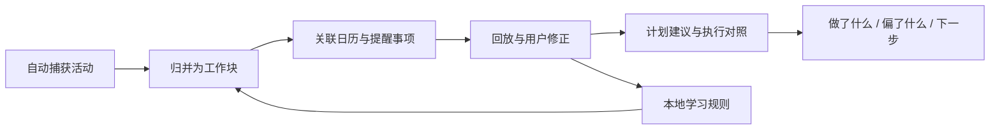

# Trace 产品案例：从活动记录到可解释的工作智能体

## 01. 执行摘要

Trace 是一款面向 macOS 知识工作者的本地优先工作回放与计划辅助产品。它读取设备活动、日历和提醒事项，把分散的行为信号归并为可修正的工作块，再帮助用户回答三个问题：

1. 我实际做了什么？
2. 实际执行与原计划有什么差异？
3. 接下来最值得推进什么？

**产品定位**

> Trace 不替代日历或任务工具，而是成为个人工作系统之上的事实层、理解层和决策辅助层。

**我的角色**

- 独立产品负责人和构建者
- 产品战略、范围与路线图
- 信息架构和核心交互
- AI 智能体、人工纠错与评估设计
- 基于 React、TypeScript、Tauri 和 macOS 原生能力完成测试版

**当前状态**

- 已完成：可运行的 macOS 测试版、活动捕获、工作块归并、日历/提醒事项上下文、计划建议、执行对照、复盘与纠错闭环
- 部分完成：本地模型生成计划与总结，失败时使用确定性逻辑回退
- 已设计、未实现：向量检索/RAG、长期模式检索和完整的离线智能体评估
- 尚未完成：外部用户研究样本、留存数据和生产环境效果验证

本案例因此展示的是**从模糊问题到可运行测试版的产品判断与系统设计**，而不是把尚未验证的结果包装成业务成果。

## 02. 问题定义与证据边界

知识工作经常分散在浏览器、文档、会议、聊天和开发工具中。日历记录“计划做什么”，活动日志记录“打开了什么”，但两者都难以解释一段时间实际推进了哪项工作。

现有方案通常存在三类缺口：

| 方案 | 能回答什么 | 关键缺口 |
|---|---|---|
| 手动计时器 | 某任务用了多久 | 记录成本高，容易中断 |
| 原始活动追踪 | 打开了哪些应用和窗口 | 噪音大，缺少工作语义 |
| AI 总结工具 | 一段内容的大意 | 缺少连续行为、计划和用户修正上下文 |

Trace 聚焦的问题不是“记录更多数据”，而是：

> 如何把低层级行为、显式计划和用户反馈转化为可信、可解释、可行动的工作判断？

### 研究与验证边界

当前问题定义来自个人工作流观察、同类产品模式分析和测试版构建过程中的技术验证，不等同于正式用户研究。以下仍是待验证假设：

- 用户是否愿意长期授权活动追踪
- 工作回放是否比时间统计更有价值
- 用户是否愿意修正系统判断以换取后续准确度
- 计划建议能否减少重新进入任务的成本

公开展示中不使用虚构访谈、虚构采用率或虚构效率提升数据。

## 03. 目标用户与核心任务

**首要用户**

- 使用 macOS 的个人知识工作者
- 已使用 Calendar 和 Reminders
- 经常跨多个工具完成同一项工作
- 不愿再维护一套重型任务系统
- 希望低摩擦地复盘和调整计划

**不在当前范围**

- 团队工时管理或员工监控
- Windows 与移动端
- 完整项目管理系统
- 自动替用户修改所有外部任务
- 医疗、法律等高风险决策场景

**核心 JTBD**

> 当一天的工作分散在多个工具里时，我希望系统能自动还原我实际推进的工作，并把它与计划对照，这样我不需要手动记账，也能决定下一步怎么调整。

## 04. 从早期版本到 V3 的战略收敛

早期方向更接近“把自动记录写回日历”的轻量时间追踪工具。继续迭代后，我识别出仅展示时间没有解决用户的决策问题，因此把 V3 收敛为工作理解与计划反馈产品。

| 方向 | 价值 | 风险 | 决策 |
|---|---|---|---|
| 完整任务/日历系统 | 产品内闭环完整 | 迁移成本高、与成熟工具正面竞争 | 不做 |
| 原始活动记录器 | 技术路径简单 | 数据噪音大、缺少行动价值 | 仅作为底层能力 |
| 聊天式效率教练 | 交互熟悉 | 上下文不连续，建议容易空泛 | 不作为主界面 |
| 工作回放 + 计划辅助 | 低迁移成本，补足事实与判断缺口 | 依赖语义质量和信任设计 | 选择 |

这次收敛带来四个明确取舍：

1. **读取已有计划，而不是重建计划系统。**
2. **先形成可审查的工作块，再生成建议。**
3. **先保证确定性核心流程，再引入生成式能力。**
4. **把用户纠错作为质量闭环，而不是边缘编辑功能。**

## 05. 核心体验与信息架构

| 页面 | 用户问题 | 关键能力 |
|---|---|---|
| 今日 | 今天发生了什么，接下来做什么？ | 状态、重点工作块、计划建议、执行进度 |
| 时间线 | 系统理解对了吗？ | 工作块回放、编辑、关联与纠错 |
| 复盘 | 一段时间内有什么模式？ | 专注、碎片化、计划覆盖、偏差和下一步 |
| 设置 | 哪些数据与规则影响结果？ | 权限、数据源、模型、忽略应用、学习规则 |

关键判断是避免让四个页面变成重复仪表盘：今日页支持即时决策，时间线建立信任，复盘支持周期性调整，设置页管理数据和控制权。

## 06. AI 智能体如何进入产品主流程

Trace 的智能体不是一个聊天人格，而是嵌入“感知—理解—计划—观察—修正”循环的产品机制。

| 能力 | 当前实现 | 后续增强 |
|---|---|---|
| 工作理解 | 规则、语义字段和用户学习规则归并活动 | 相似历史工作块检索 |
| 上下文构建 | Calendar、Reminders、活动历史和系统警告 | 更多只读上下文源 |
| 计划 | 确定性排序/排程 + 可选本地 LLM 结构化输出 | 检索依据、个性化节奏 |
| 执行监控 | 计划块与实际工作块匹配 | 更可靠的语义匹配与置信度校准 |
| 复盘 | 指标摘要、偏差提示、本地 AI 总结与回退 | 跨周期模式检索 |

完整的工具、记忆、RAG 和失败回退设计见 [AI 智能体系统设计](ai-agent-system-design.md)。

## 07. 信任、隐私与人工参与

活动历史属于高度敏感数据，因此信任不是视觉层提示，而是系统约束。

**本地优先**

- 活动和学习规则保存在本机
- 使用本地模型时不依赖云端上传
- 核心回放和计划逻辑不依赖模型可用性

**可修正**

用户可修改工作块标题、分类、活动类型、上下文键、时间范围以及 Calendar/Reminders 关联。修正会更新当前记录，并形成可查看、可清除的本地规则。

**低置信度回退**

- 上下文读取失败：显示警告并使用缓存或已有记录
- 本地模型不可用：使用确定性计划和结构化摘要
- 证据不足：要求用户确认，不强行建立关联
- 日历写回冲突：保护用户手动修改，不静默覆盖

产品原则是：**可修正性比“看起来聪明”更重要，稳定的降级路径比强制 AI 更可信。**

## 08. 技术约束如何影响产品决策

Trace 不是纯原型。桌面端实现暴露了会直接影响体验的真实约束：

| 约束 | 产品响应 |
|---|---|
| 活动窗口追踪需要系统权限 | 明确状态和授权反馈，避免重复打扰 |
| Calendar/Reminders 可能超时或拒绝权限 | 缓存、健康状态、超时与重试 |
| 睡眠/唤醒导致活动间隔异常 | 在归并逻辑中处理心跳和时间间隔 |
| 本地模型延迟或不可用 | AI 不阻塞基础价值，始终提供回退 |
| 自动关联可能出错 | 展示依据并允许手动绑定/解绑 |
| 日历记录可能被用户编辑 | 识别并保护用户修改 |

这种约束驱动的设计比单独展示 UI 更能说明产品、工程与风险之间的协作判断。

## 09. 实现证据与诚实状态

| 能力 | 状态 | 仓库证据 |
|---|---|---|
| macOS 桌面端和活动捕获 | 测试版已实现 | `src-tauri/`, `src-tauri/src/watcher/` |
| 工作块归并与上下文匹配 | 测试版已实现 | `src/utils/workblocks.ts` |
| Calendar/Reminders 集成 | 测试版已实现 | `src-tauri/src/calendar.rs`, `src/services/ipc/` |
| 计划生成、解析与确定性回退 | 测试版已实现 | `src/utils/planning.ts`, `src/pages/Today.tsx` |
| 纠错和本地学习规则 | 测试版已实现 | `src/pages/Timeline.tsx`, `src-tauri/src/main.rs` |
| 复盘和偏差分析 | 测试版已实现 | `src/pages/Review.tsx`, `src/pages/Analytics.tsx` |
| 本地 AI 总结 | 有回退的测试版 | `src-tauri/src/main.rs` |
| 向量检索/RAG | 已设计，未实现 | [AI 智能体系统设计](ai-agent-system-design.md) |
| 智能体离线评估集 | 指标已定义，待建立 | `scripts/run-workblock-validations.ts` 为当前逻辑验证基础 |

## 10. 评估框架

当前阶段不能用留存或业务增长证明价值，因此评估分为三层。

### A. 离线正确性

| 指标 | 目标问题 |
|---|---|
| 工作块归并准确率 | 是否把噪音变成正确工作单元？ |
| Calendar/Reminders 匹配精确率 | 计划对照是否有依据？ |
| 重复修正下降率 | 学习规则是否减少同类错误？ |
| 低置信度拦截精确率 | 系统是否知道何时不应自动判断？ |

### B. 任务可用性

- 用户能否在 30 秒内理解今天的主线
- 用户能否定位并修正错误工作块
- 用户能否理解建议的来源和排序理由
- 模型不可用时核心任务是否仍可完成

### C. 产品价值

- 每周复盘完成率
- 计划建议采纳率
- 计划块执行匹配率
- 用户对“回放是否准确”和“建议是否可行动”的评分
- 4 周后是否仍愿意保留追踪权限

这些是**待验证指标**，不是已取得的结果。

## 11. 下一步路线图

| 阶段 | 目标 | 退出条件 |
|---|---|---|
| 1. 可靠性 | 稳定权限、捕获、归并、同步和回退 | 核心测试场景通过，错误状态可恢复 |
| 2. 理解质量 | 建立标注集并优化纠错学习 | 关键工作块和计划匹配达到可接受精确率 |
| 3. 检索增强 | 引入本地索引、证据引用和置信度 | 建议能展示有效依据，弱证据正确回退 |
| 4. 外部验证 | 小规模封闭测试 | 证明用户理解、信任并重复使用核心闭环 |

在完成第三方验证前，不扩展团队协作、跨平台或大量外部集成。

## 12. 反思

Trace 最重要的产品变化不是“增加 AI”，而是从记录时间转向帮助用户形成可信判断。

这个项目体现的 Senior PM 能力包括：

- 从宽泛的效率问题中选择可交付的产品楔子
- 通过明确非目标控制 0→1 范围
- 把智能体拆解为工具、记忆、计划、观察、回退和纠错机制
- 让隐私、权限和系统失败进入产品设计，而不是留给工程兜底
- 区分已实现能力、设计方案和待验证假设
- 为下一阶段定义可证伪的评估框架

最终判断是：

> 一个可信的个人工作智能体不应该假装替用户掌控一切。它应该基于事实给出有限、可解释、可修正的建议，并在证据不足时主动退让。
