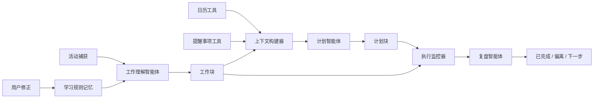

# Trace 中文作品集案例：AI 工作回放与计划智能体

## 01. 项目概览

Trace 是一款面向 Mac 系统知识工作者的本地优先 AI 工作回放与计划智能体。它不替代日历、提醒事项或笔记工具，而是在用户已有工作习惯之上，自动记录真实活动、归并成可理解的工作块，并通过一个轻量的个人计划智能体帮用户判断：今天实际做了什么、是否推进了计划、接下来应该怎么安排。

**一句话定位**

> Trace 是用户个人工作流中的事实层、理解层和计划辅助层：它读取真实行为与计划上下文，生成可修正的工作回放、计划对照和下一步建议。

**我的角色**

- 产品负责人
- 用户体验与信息架构设计
- AI 智能体工作流设计
- 独立产品构建者

**核心交付**

- 定义产品定位、目标用户、产品边界和非目标
- 设计从原始活动记录到工作块理解的 AI 产品链路
- 设计个人计划智能体：读取上下文、判断优先级、生成计划块、解释理由、跟踪执行状态
- 设计今日页 / 时间线页 / 复盘页 / 设置页 四页主信息架构
- 设计日历 / 提醒事项上下文对照、用户修正、学习规则和 AI 复盘机制
- 基于桌面应用框架和 Mac 系统原生能力推进可运行测试版

## 02. 背景与用户问题

很多知识工作者每天都在高频切换浏览器、文档、代码工具、聊天工具、会议和资料页面。表面上他们很忙，但一天结束后经常无法回答：

1. 我今天到底做了什么？
2. 哪些工作真正推进了计划？
3. 哪些时间只是碎片切换、漂移或低价值占用？
4. 为什么计划和实际执行出现偏差？
5. 今天剩下的时间应该优先做什么？
6. 明天应该如何调整计划？

传统时间追踪工具通常只能回答“用了多少分钟”，但不能解释“这段时间代表什么工作”。普通 AI 总结也只能在事后概括，不能真正参与计划判断。因此 Trace 的核心问题不是“帮用户计时”，而是：

> 如何把低层级的电脑活动记录、日历安排和提醒事项，转化成用户可以理解、修正和行动的工作事实与计划建议。

## 03. 目标用户

Trace 当前阶段聚焦一个明确人群：

- 使用 Mac 系统的个人知识工作者
- 本来就使用日历和提醒事项
- 不愿意再维护一个复杂任务系统
- 经常在多个工具之间切换
- 想要自动复盘，而不是手动填报时间
- 需要下一步建议，但不希望被一个重型系统接管
- 更关心“理解工作模式”和“调整计划”，而不是单纯记录工时

这个目标用户不是没有计划工具，而是缺少一个能还原事实、判断偏差、解释原因、辅助下一步安排的个人智能体。

## 04. 产品战略取舍

Trace 早期有两条可能路径。

| 方向 | 做法 | 优点 | 风险 | 最终判断 |
|---|---|---|---|---|
| 重型工作系统 | 内建任务管理、日历、时间线、团队功能 | 产品内闭环强 | 学习成本高、迁移成本高、容易变重 | 不选 |
| 轻量理解层 + 计划智能体 | 读取日历 / 提醒事项，只做自动追溯、理解、复盘和下一步建议 | 低摩擦、边界清晰、容易持续使用 | 对上下文理解和解释质量要求高 | 选择 |

最终选择：

> Trace 不做新的任务系统，而是成为用户已有工作系统上的“事实层、理解层、计划辅助层”。

这个取舍直接影响了后续所有产品设计：

- 日历继续负责日程安排
- 提醒事项继续负责轻量计划
- Trace 负责记录真实发生的事
- Trace 负责判断实际工作和计划之间的关系
- Trace 的智能体负责根据当前上下文生成剩余时间安排和下一步动作
- Trace 负责输出可行动复盘

## 05. 产品原则

### 1. 不改变用户原始习惯

用户不需要迁移到 Trace 里重新做计划，也不需要在 Trace 里维护复杂任务。

### 2. 自动优先

能自动捕获、归并和推断的，不要求用户手动输入。

### 3. 智能体只辅助，不接管

Trace 的智能体可以建议下一步、解释优先级和生成计划块，但不默认替用户修改原始提醒事项，也不强迫用户接受建议。

### 4. 解释优先

不要只给统计图，而要解释发生了什么、为什么偏离、哪些事情被推进、下一步应该做什么。

### 5. 可修正优先

AI 判断一定会出错，所以 Trace 必须允许用户修正事件、分类、时间和关联关系。

### 6. 本地优先

工作活动数据高度私人，Trace 当前阶段优先本地存储、本地处理、本地 AI 总结。

## 06. AI 智能体的产品定义

Trace 里的智能体不是聊天机器人，也不是一个悬浮助手形象。它是一个嵌入产品主流程的个人工作理解与计划智能体。

**智能体目标**

> 基于用户真实活动、日历、提醒事项、历史工作块和用户修正记录，判断当前计划推进状态，生成可解释的剩余时间安排，并在复盘中指出偏差和下一步动作。

**智能体边界**

| 智能体可以做 | 智能体不应该做 |
|---|---|
| 读取当天活动、日历和提醒事项 | 替代用户维护完整任务系统 |
| 识别哪些事项已经被推进 | 默认修改用户原始提醒事项 |
| 判断剩余时间该优先处理什么 | 自动创建大量任务或打断用户 |
| 给出下一步动作、准备提示、精力要求 | 用泛泛建议替代具体上下文 |
| 解释为什么这样排序 | 在低置信度时假装确定 |
| 学习用户修正形成规则 | 让用户无法查看或重置规则 |

## 07. 智能体系统架构

### 智能体由 4 个子能力组成

| 子能力 | 负责什么 | 输入 | 输出 |
|---|---|---|---|
| 工作理解智能体 | 把窗口活动理解成工作块 | 应用、窗口标题、时长、分类规则、学习规则 | 工作块、活动类型、上下文键、专注评分 |
| 上下文构建器 | 读取外部工具上下文 | 日历、提醒事项、历史活动 | 今日计划、日程占用、未完成提醒、系统警告 |
| 计划智能体 | 生成剩余时间计划 | 未完成提醒、可用时间、今天已推进事项、用户历史节奏 | 计划块、下一步动作、准备提示、精力要求、优先级理由 |
| 复盘智能体 | 生成复盘结论 | 工作块、计划匹配、偏差、低价值占用 | 做了什么、偏了什么、下一步 |

## 08. 智能体的工具使用设计

Trace 的智能体不是凭空给建议，而是通过工具和上下文做判断。

| 工具 / 上下文 | 智能体如何使用 | 产品价值 |
|---|---|---|
| 系统活动追踪 | 读取用户真实行为 | 避免只依赖用户主观记忆 |
| 日历 | 判断时间占用和日程约束 | 避免计划建议撞上会议或固定安排 |
| 提醒事项 | 读取用户原始计划意图 | 不要求用户迁移任务系统 |
| 本地活动历史 | 判断今天已经推进过什么 | 优先延续已有工作主线 |
| 本地检索增强生成 | 检索相关历史工作块、相似提醒事项、用户修正规则和近期计划上下文 | 让智能体的建议基于用户真实上下文，而不是泛泛生成 |
| 学习规则 | 复用用户修正结果 | 逐步提高识别准确性 |
| 本地 AI 总结 | 生成结构化复盘 | 把数据变成可行动结论 |
| 日历写回 | 可选写入计划或追溯块 | 让结果回到用户熟悉的系统工具 |

## 09. 智能体的记忆与学习机制

Trace 的记忆 不是泛泛的聊天记忆，而是产品内可解释的工作理解记忆。

### 短期上下文

- 今天的活动记录
- 当前工作块
- 今日日历事件
- 未完成提醒事项
- 已生成的计划建议
- 当前周期复盘缓存

### 长期/本地记忆

- 学习规则
- 用户修正过的分类
- 用户修正过的上下文键
- 用户手动关联过的提醒事项
- 日历手动编辑后的识别规则
- 忽略应用列表
- 分类规则草稿

### 为什么需要记忆

如果没有记忆，智能体每天都从零开始判断，用户会反复修正同类错误。Trace 的学习闭环要解决的是：

> 用户修正一次，系统后续应该更接近用户真实语义。

## 10. 检索增强生成 / 上下文锚定设计

Trace 的检索增强生成不是用于问答知识库，而是用于给个人工作智能体提供上下文锚定。它要解决的问题是：同一个窗口标题、同一个提醒事项或同一个项目关键词，在不同用户、不同阶段可能代表不同工作语义。

**可检索内容**

| 检索对象 | 用途 |
|---|---|
| 历史工作块 | 找到相似应用 / 标题 / 上下文键 对应的真实工作类型 |
| 提醒事项 | 识别当前建议是否对应用户已有计划意图 |
| 日历事件 | 判断会议、固定安排和时间约束 |
| 学习规则 | 复用用户纠错后的分类、命名和关联关系 |
| 近期复盘摘要 | 判断近期主线、重复偏差和未完成动作 |

**检索增强生成在智能体中的作用**

1. 工作理解智能体检索相似历史记录，提升工作块命名和分类准确率。
2. 计划智能体检索未完成提醒、近期主线和空闲时间，生成更贴近当前上下文的计划块。
3. 执行监控器检索计划块和实际工作块 的语义相似度，判断是否推进了计划。
4. 复盘智能体检索近期模式和历史偏差，避免每天输出重复、泛泛的总结。

**产品边界**

- 不把所有原始活动无差别塞进提示词。
- 不用检索增强生成生成看似聪明但无法解释的建议。
- 优先展示检索依据，例如来源提醒事项、相关日历、相似历史工作块。
- 当检索结果置信度低时，智能体应提示用户修正，而不是强行判断。

## 11. 智能体的规划逻辑

Trace 的计划智能体不是简单列 待办事项，而是生成“可执行计划块”。每个计划块包含：

- 标题
- 开始时间 / 结束时间
- 时长
- 来源提醒事项
- 置信度
- 理由
- 下一步动作
- 准备提示
- 精力要求
- 优先级理由

### 规划输入

| 输入 | 用途 |
|---|---|
| 未完成提醒事项 | 判断用户原始意图 |
| 今日日历空闲时间 | 避免安排冲突 |
| 今日已发生工作块 | 判断是否应该延续当前主线 |
| 提醒事项紧急程度 | 判断 截止日期 / 今日 / 尽快 |
| 预计时长 | 估算任务块长度 |
| 精力推断 | 判断高专注、中专注、低压任务 |
| 检索上下文 | 使用相似历史工作块、近期复盘和 学习规则作为 锚定 |

### 规划输出示例

| 字段 | 示例 |
|---|---|
| 标题 | 完善产品案例研究 |
| 时长 | 60 分钟 |
| 来源提醒事项 | 更新产品案例材料 |
| 置信度 | 高 |
| 理由 | 今天已经在同一产品项目上投入较多时间，继续推进可以减少上下文切换 |
| 下一步动作 | 先补充问题定义和智能体设计说明，再检查关键指标表述 |
| 准备提示 | 打开产品案例文档、设计稿和关键实现说明 |
| 精力要求 | 高专注 |
| 优先级理由 | 与当前产品交付主线强相关，且今天已有工作动量 |

## 12. 智能体的执行监控

计划智能体生成计划后，Trace 会把实际工作块和计划块 对照。

| 状态 | 判断依据 | 产品含义 |
|---|---|---|
| 已完成 | 实际匹配时长接近计划时长 | 计划被有效推进 |
| 推进中 | 已有明显相关工作，但尚未完成 | 可以继续延续主线 |
| 已开始 | 有少量相关工作 | 用户已进入上下文 |
| 待开始 | 没有相关工作 | 后续仍需安排 |
| 明显偏移 | 到了计划时间但实际做了无关工作 | 需要复盘偏差原因 |

这让 Trace 从“记录工具”升级成“计划执行反馈工具”。

## 13. 人工参与闭环设计

AI 智能体产品不能只追求自动化。Trace 的关键是让用户能纠错。

用户可修正：

- 工作块标题
- 分类
- 活动类型
- 上下文键
- 起止时间
- 提醒事项关联
- 日历关联

修正后的系统动作：

1. 更新当前记录
2. 写入本地学习规则
3. 后续类似活动复用规则
4. 在日历手动编辑时避免覆盖用户修改

产品判断：

> 对 AI 智能体来说，可修正能力不是补充功能，而是信任机制。

## 14. 信息架构

Trace 当前版本保留四个主页面。

| 页面 | 回答的问题 | 智能体相关能力 |
|---|---|---|
| 今日页 | 我今天发生了什么？接下来应该做什么？ | 计划智能体、执行状态、实时上下文 |
| 时间线页 | 具体时间发生了什么？哪里需要修正？ | 工作理解智能体、修正闭环 |
| 复盘页 | 一段时间内我的工作模式是什么？ | 复盘智能体、偏离分析、下一步 |
| 设置页 | 哪些数据源和规则会影响追溯质量？ | 工具配置、AI 模型、学习规则 |

关键设计判断：

> 今日页不是 仪表盘，时间线页 不是原始日志，复盘页不是今日页 的长版本。每个页面必须有清晰职责。

## 15. 页面设计重点

### 今日页

今日页让用户 30 秒内知道 Trace 是否正在工作、今天已经记录了什么、哪些事情在推进计划、哪些事情偏离计划、接下来应该优先做什么。

智能体重点：

- 读取今日提醒事项和日历
- 基于剩余时间生成计划建议
- 展示每个计划块的执行状态
- 解释为什么某个事项优先

### 时间线页

时间线页解决信任问题。它展示聚合工作块而不是原始窗口事件，并允许用户编辑标题、分类、活动类型、上下文键、时间和计划关联。

智能体重点：

- 暴露 AI 识别结果
- 允许用户修正
- 把修正变成学习规则

### 复盘页

复盘页关注长期模式，而不是实时发生了什么。AI 总结固定为三部分：做了什么、偏了什么、下一步。

智能体重点：

- 总结一段时间的真实工作结构
- 识别计划偏差和低价值占用
- 给出下一步调整建议

### 设置页

设置页只暴露影响追溯质量的关键设置：追踪、日历、提醒事项、AI、本地规则和忽略应用。

智能体重点：

- 控制数据源
- 控制 AI 模型
- 查看和清理学习规则
- 配置忽略应用和分类规则

## 16. 技术与产品协作理解

Trace 的技术复杂点主要来自 Mac 系统本地环境：活动窗口追踪、系统权限处理、日历 / 提醒事项读取与写入、本地数据存储、睡眠 / 唤醒恢复、本地 AI 总结、用户手动编辑后的同步与学习。

这些限制影响了产品设计：

- 不能频繁打扰用户授权
- 不能覆盖用户手动修改的日历事件
- 上下文读取失败时要有缓存和兜底
- 检索增强生成失败或结果不足时要回退到规则和显式上下文，而不是输出无依据建议
- AI 总结失败时不能阻塞核心复盘
- 本地规则必须可解释、可重置
- 智能体建议必须可选写入，而不是默认接管用户系统

## 17. 指标与评估设计

| 指标 | 衡量什么 |
|---|---|
| 工作块归并准确率 | 是否真的把噪音变成可理解工作 |
| 提醒事项 / 日历匹配准确率 | 智能体的计划对照是否可信 |
| 计划建议采纳率 | 计划智能体是否真的有用 |
| 计划块执行匹配率 | 建议是否能转化为实际行动 |
| 用户修正率 | AI 判断错误程度 |
| 重复修正下降率 | 学习规则是否有效 |
| 检索命中率与引用准确率 | 检索到的上下文是否真实支持智能体判断 |
| 低置信度拦截率 | 智能体是否能在证据不足时避免过度自动化 |
| 复盘完成率 | 用户是否愿意回来看 |
| AI 总结有用率 | 复盘智能体输出是否可行动 |
| 兜底触发率 | AI / 系统工具不稳定时体验是否可控 |

## 18. 路线图

### 阶段 1：测试版 可靠性

活动追踪稳定、权限处理稳定、日历 / 提醒事项 健康状态明确、用户修正可持久化、核心页面数据一致。

### 阶段 2：智能体理解质量

更准确的工作块归并、更好的计划对照、低置信度工作块提示、修正学习效果评估、计划建议采纳率追踪。

### 阶段 3：主动计划助手

根据未完成计划生成剩余时间建议，根据历史工作模式生成准备提示，根据用户偏差模式提供下一步建议，并在不变重的前提下增强个人上下文记忆。

### 阶段 4：低风险外部连接

在不重做任务系统的前提下，逐步支持更多只读上下文源；坚持读多写少、可解释、可回退。

## 19. 反思

Trace 最重要的产品判断不是“要不要加 AI”，而是：

> AI 智能体应该负责理解事实、解释偏差、提出下一步建议，并在低置信度时请求用户修正；它不应该替用户重建一套新的工作系统，也不应该默认接管用户原始工具。

这个项目证明的是：我能从模糊问题中定义产品边界，把 AI 智能体能力拆成可落地的产品机制，设计上下文、检索增强生成、记忆、工具使用、规划、兜底和人工参与闭环，并把一个 AI 产品从概念推进到可运行测试版。
