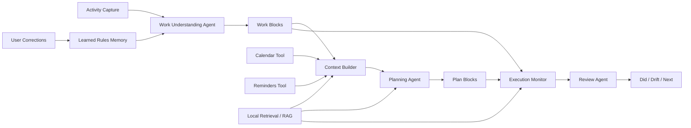

# Trace Portfolio Case Study: AI Work Replay and Planning Agent

## 01. Project Overview

Trace is a local-first AI work replay and planning agent for macOS knowledge workers. It does not replace Calendar, Reminders, Notion, or task management tools. Instead, it sits on top of existing work habits, captures what actually happened, compresses noisy activity signals into understandable work blocks, and helps the user answer: what did I work on today, did it move my plan forward, and what should I do next?

**One-line positioning**

> Trace is the factual layer, interpretation layer, and planning assistance layer for a personal work system: it reads real activity and planning context, then produces correctable work replay, plan comparison, and next-step recommendations.

**My role**

- Product owner
- UX and information architecture designer
- AI agent workflow designer
- Independent product builder

**Core deliverables**

- Defined product positioning, target users, product boundaries, and non-goals
- Designed the AI product flow from raw activity records to semantic work blocks
- Designed a personal planning agent that reads context, prioritizes work, generates plan blocks, explains decisions, and monitors execution
- Designed the Today / Timeline / Review / Settings information architecture
- Designed Calendar / Reminders alignment, user corrections, learned rules, RAG grounding, and AI review flows
- Advanced the product toward a working beta using Tauri and macOS-native capabilities

## 02. Background and User Problem

Knowledge workers often switch across browsers, documents, code editors, chat tools, meetings, and research pages throughout the day. They may feel busy, but at the end of the day they often cannot answer:

1. What did I actually work on?
2. Which work moved my plan forward?
3. Which time blocks were fragmentation, drift, or low-value activity?
4. Why did the plan and actual execution diverge?
5. What should I prioritize with the time left today?
6. What should I adjust tomorrow?

Traditional time trackers usually answer "how many minutes," but not "what work did this time represent." Generic AI summaries can describe the day after the fact, but they usually do not participate in plan comparison or execution judgment.

Therefore, Trace is not primarily a timer. The product question is:

> How can low-level computer activity, calendar context, and reminder context be converted into understandable, correctable, and actionable work facts and planning recommendations?

## 03. Target Users

Trace focuses on a specific early user segment:

- Individual macOS knowledge workers
- Users who already use Calendar and Reminders
- Users who do not want to maintain another heavy task system
- Users who frequently switch across many tools and contexts
- Users who want automatic review instead of manual time reporting
- Users who need next-step suggestions but do not want a system to take over their workflow
- Users who care more about understanding and adjusting work patterns than tracking billable hours

The target user already has planning tools. What is missing is a personal agent that can reconstruct facts, identify drift, explain why it happened, and assist the next planning decision.

## 04. Product Strategy and Tradeoffs

Trace had two possible early product directions.

| Direction | Approach | Advantage | Risk | Decision |
|---|---|---|---|---|
| Heavy work system | Build native tasks, calendar, timeline, and team workflows | Strong in-product loop | High learning cost, high migration cost, product becomes heavy | Rejected |
| Lightweight interpretation layer + planning agent | Read Calendar / Reminders and focus on replay, understanding, review, and next-step suggestions | Low friction, clear boundary, easier to keep using | Requires high context quality and explanation quality | Chosen |

Final strategy:

> Trace should not become another task system. It should become the factual layer, interpretation layer, and planning assistance layer on top of the user's existing work system.

This decision shaped every downstream product choice:

- Calendar remains responsible for schedules
- Reminders remains responsible for lightweight task intent
- Trace records what actually happened
- Trace compares actual work against planning context
- Trace's agent generates remaining-day plans and next actions from current context
- Trace outputs actionable reviews

## 05. Product Principles

### 1. Do not change the user's original habits

Users should not need to migrate their planning workflow into Trace or maintain a complex task system inside Trace.

### 2. Automate first

If Trace can capture, aggregate, or infer something automatically, it should not ask the user to manually enter it.

### 3. The agent assists, but does not take over

The agent can suggest next steps, explain priorities, and generate plan blocks, but it should not silently modify the user's original Reminders or force acceptance.

### 4. Explainability first

Trace should not only show charts. It should explain what happened, why work drifted, which items progressed, and what to do next.

### 5. Correctability first

AI judgments will be wrong. Trace must allow users to correct events, categories, time ranges, and context links.

### 6. Local-first

Work activity data is highly private. Trace prioritizes local storage, local processing, and local AI review where possible.

## 06. AI Agent Product Definition

The Trace agent is not a chatbot or floating assistant. It is an embedded personal work understanding and planning agent.

**Agent goal**

> Based on real user activity, Calendar, Reminders, historical work blocks, retrieved context, and user corrections, determine the current plan execution state, generate explainable remaining-day plans, and surface drift and next actions during review.

**Agent boundary**

| The agent can | The agent should not |
|---|---|
| Read daily activity, Calendar, and Reminders | Replace the user's task system |
| Identify which planned items have progressed | Silently modify original Reminders |
| Decide what should be prioritized with remaining time | Create many tasks or interrupt the user by default |
| Provide next action, prep hint, energy level, and priority reason | Give generic advice without context |
| Explain why a suggestion is ranked higher | Pretend to be confident when evidence is weak |
| Learn from user corrections | Hide or lock learned rules |

## 07. Agent System Architecture

### Agent capabilities

| Capability | Responsibility | Input | Output |
|---|---|---|---|
| Work Understanding Agent | Convert window activity into work blocks | app, window title, duration, category rules, learned rules, retrieved similar blocks | work block, activity type, context key, focus score |
| Context Builder | Read external planning context | Calendar, Reminders, historical activity, retrieved context | today's plan, occupied time, incomplete reminders, system warnings |
| Retrieval / RAG Layer | Retrieve relevant evidence from local work history and planning context | query context, work blocks, reminders, calendar events, learned rules, review summaries | grounded evidence, similar blocks, source references |
| Planning Agent | Generate remaining-day plans | incomplete reminders, free time, already-progressed work, user rhythm, retrieved evidence | plan block, next action, prep hint, energy level, priority reason |
| Execution Monitor | Compare planned work with actual work | plan blocks, actual work blocks, semantic matches | completed, progressing, started, not started, drifted |
| Review Agent | Generate review conclusions | work blocks, plan match, drift, low-value time, recent summaries | what was done, what drifted, what to do next |

## 08. Tool Use Design

Trace's agent does not generate suggestions from empty prompts. It uses tools and context to ground decisions.

| Tool / Context | How the agent uses it | Product value |
|---|---|---|
| macOS activity tracking | Reads real user behavior | Avoids relying on subjective memory |
| Calendar | Understands occupied time and scheduling constraints | Prevents suggestions from conflicting with meetings |
| Reminders | Reads original task intent | Avoids asking users to migrate task systems |
| local activity history | Checks what has already progressed today | Prioritizes continuity and reduces context switching |
| local retrieval / RAG | Retrieves similar work blocks, related reminders, calendar constraints, and learned rules | Grounds recommendations in the user's real context |
| learned rules | Reuses user corrections | Improves recognition over time |
| local AI summary | Produces structured review | Converts data into actionable conclusions |
| Calendar writeback | Optionally writes plan or replay blocks | Returns output to a familiar system tool |

## 09. Memory and Learning

Trace's memory is not generic chat memory. It is explainable product memory for work understanding.

### Short-term context

- Today's activity records
- Current work blocks
- Today's Calendar events
- Incomplete Reminders
- Generated plan suggestions
- Current review cache

### Long-term local memory

- learned rules
- corrected categories
- corrected context keys
- manually linked reminders
- Calendar edit recognition rules
- ignored applications
- category rule drafts

### Why memory matters

Without memory, the agent starts from zero every day and users must repeat the same corrections. Trace's learning loop is designed around:

> If the user corrects a pattern once, the system should become closer to the user's real semantics next time.

## 10. RAG / Context Grounding

Trace uses RAG not as a generic Q&A knowledge base, but as a grounding layer for a personal work agent. The problem is that the same app, window title, reminder, or project keyword can mean different things for different users and at different stages of work.

**Retrieval sources**

| Retrieval source | Purpose |
|---|---|
| Historical work blocks | Find similar app / title / context key patterns and their corrected work meaning |
| Reminders | Identify whether a suggestion maps to existing user intent |
| Calendar events | Understand meetings, fixed commitments, and free-time constraints |
| learned rules | Reuse corrected categories, labels, and relationships |
| recent review summaries | Identify active themes, repeated drift, and unfinished next actions |

**How RAG supports the agent**

1. Work Understanding Agent retrieves similar historical records to improve naming and categorization.
2. Planning Agent retrieves incomplete reminders, recent themes, and available time to produce contextual plan blocks.
3. Execution Monitor compares plan blocks and actual work blocks using semantic similarity and retrieved evidence.
4. Review Agent retrieves recent patterns and past drift to avoid generic, repetitive summaries.

**Product boundaries**

- Do not put all raw activity events into the prompt.
- Do not use RAG to produce suggestions that look smart but cannot be explained.
- Show evidence where possible, such as source Reminder, related Calendar event, or similar historical work block.
- If retrieved evidence has low confidence, ask for correction instead of forcing a judgment.

## 11. Planning Logic

The Planning Agent does not simply list TODO items. It generates executable plan blocks. Each plan block includes:

- title
- start time / end time
- duration
- source reminder
- confidence
- rationale
- next action
- prep hint
- energy level
- priority reason
- supporting evidence

### Planning input

| Input | Use |
|---|---|
| incomplete Reminders | Understand original user intent |
| today's Calendar free time | Avoid conflicts |
| today's work blocks | Decide whether to continue the current work theme |
| reminder urgency | Detect deadline / today / ASAP |
| estimated duration | Estimate block length |
| energy inference | Classify high-focus, medium-focus, and low-pressure work |
| retrieved context | Ground recommendations with similar historical work, recent reviews, and learned rules |

### Example output

| Field | Example |
|---|---|
| title | Refine product case study |
| duration | 60 min |
| source reminder | Update product case materials |
| confidence | High |
| rationale | You already spent significant time on the same product project today; continuing reduces context switching |
| next action | Add problem definition and agent design details, then review metric clarity |
| prep hint | Open the product case document, design reference, and implementation notes |
| energy | High-focus |
| priority reason | Strongly aligned with the current product delivery priority and today already has work momentum |
| evidence | Related reminder, recent product work block, active case-study document |

## 12. Execution Monitoring

After the Planning Agent generates plan blocks, Trace compares actual work blocks against planned blocks.

| State | Evidence | Product meaning |
|---|---|---|
| Completed | Actual matched time is close to planned duration | The plan was effectively advanced |
| Progressing | Clear related work exists but is not complete | The user can continue the current thread |
| Started | Some related work exists | The user has entered the context |
| Not started | No related work is detected | The item still needs scheduling |
| Drifted | Planned time arrived but actual work was unrelated | The user needs drift review |

This upgrades Trace from a recording tool to a plan-execution feedback tool.

## 13. Human-in-the-loop Design

An AI agent product should not optimize only for automation. Trace's trust mechanism is correction.

Users can correct:

- work block title
- category
- activity type
- context key
- start / end time
- Reminder link
- Calendar link

System behavior after correction:

1. Update the current record
2. Write local learned rules
3. Reuse similar rules later
4. Avoid overwriting manually edited Calendar events

Product judgment:

> For an AI agent, correctability is not a secondary feature. It is the trust mechanism.

## 14. Information Architecture

Trace keeps four main pages in the current version.

| Page | User question | Agent capability |
|---|---|---|
| Today | What happened today? What should I do next? | Planning Agent, execution status, live context |
| Timeline | What exactly happened at each time? What needs correction? | Work Understanding Agent, correction loop |
| Review | What are my work patterns over a period? | Review Agent, drift analysis, next step |
| Settings | Which data sources and rules affect replay quality? | tool configuration, AI model, learned rules |

Key product decision:

> Today is not a dashboard, Timeline is not a raw log, and Review is not a longer version of Today. Each page must have a distinct job.

## 15. Page Design Focus

### Today

Today helps users understand within 30 seconds whether Trace is working, what has been captured, what is moving the plan forward, what has drifted, and what should be prioritized next.

Agent focus:

- Read today's Reminders and Calendar
- Generate remaining-day plan suggestions
- Show execution state for each plan block
- Explain why an item is prioritized

### Timeline

Timeline solves the trust problem. It shows aggregated work blocks instead of raw window events, and allows users to edit title, category, activity type, context key, time, and planning links.

Agent focus:

- Expose AI interpretation results
- Let users correct them
- Convert corrections into learned rules

### Review

Review focuses on longer-term patterns rather than real-time state. The AI summary is structured into three parts: did, drift, next.

Agent focus:

- Summarize real work structure over a period
- Identify planning drift and low-value time
- Recommend the next adjustment

### Settings

Settings exposes only the controls that affect replay quality: tracking, Calendar, Reminders, AI, local rules, and ignored apps.

Agent focus:

- Control data sources
- Control AI model behavior
- View and clear learned rules
- Configure ignored apps and category rules

## 16. Technical and Product Collaboration Understanding

Trace's technical complexity comes mainly from the local macOS environment: active-window tracking, system permissions, Calendar / Reminders read-write behavior, local data storage, sleep / wake recovery, local AI summaries, user-edited Calendar events, retrieval quality, and learned rules.

These constraints shaped product design:

- Do not repeatedly interrupt users with permission prompts
- Do not overwrite manually edited Calendar events
- Use cache and fallback when context reading fails
- Fall back to rules and explicit Calendar / Reminders context when retrieval evidence is weak
- Do not block core review when AI summary fails
- Keep local rules explainable and resettable
- Make agent suggestions optional to write back, instead of taking over system tools by default

## 17. Metrics and Evaluation

| Metric | What it measures |
|---|---|
| work-block aggregation accuracy | Whether noise is actually compressed into understandable work |
| Reminder / Calendar matching accuracy | Whether plan comparison is trustworthy |
| plan suggestion adoption rate | Whether the Planning Agent is useful |
| plan execution match rate | Whether suggestions turn into actual behavior |
| manual correction rate | Cost of AI misinterpretation |
| repeated correction reduction | Whether learned rules are effective |
| retrieval hit rate and evidence precision | Whether RAG finds context that genuinely supports the agent output |
| low-confidence fallback rate | Whether the agent avoids over-automation when evidence is weak |
| review completion rate | Whether users return to review |
| AI summary usefulness | Whether Review Agent output is actionable |
| fallback trigger rate | Whether AI and system-tool instability are controlled |

## 18. Roadmap

### Phase 1: Beta reliability

Stabilize activity tracking, permission handling, Calendar / Reminders health states, correction persistence, and cross-page data consistency.

### Phase 2: Agent understanding quality

Improve work-block aggregation, plan alignment, low-confidence prompts, correction learning evaluation, retrieval grounding quality, and plan suggestion adoption tracking.

### Phase 3: Proactive planning assistant

Generate remaining-day plans from unfinished reminders, provide prep hints based on historical work patterns, suggest next actions based on drift patterns, and strengthen personal memory without making the product heavy.

### Phase 4: Low-risk external context

Gradually support more read-only context sources without rebuilding a task system; keep the principle of read more, write less, explain clearly, and allow rollback.

## 19. Reflection

The most important product judgment in Trace is not "whether to add AI." It is:

> An AI agent should understand facts, explain drift, recommend next steps, and ask for correction when confidence is low. It should not rebuild the user's work system or silently take over original tools.

This project demonstrates my ability to turn an ambiguous problem into a bounded product, break AI agent capability into shippable mechanisms, and design context, RAG, memory, tool use, planning, fallback, and human-in-the-loop for a working AI product.
