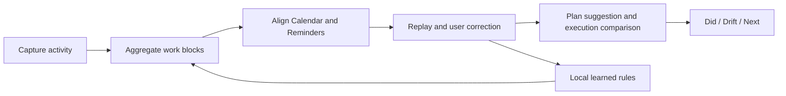
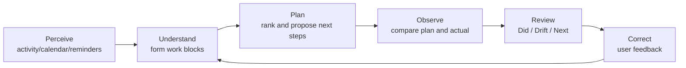

# Trace Product Case Study: From Activity Logs to an Explainable Work Agent

## 01. Executive Summary

Trace is a local-first work replay and planning assistant for macOS knowledge workers. It reads device activity, Calendar, and Reminders, compresses fragmented signals into correctable work blocks, and helps users answer three questions:

1. What did I actually work on?
2. How did execution differ from my plan?
3. What is the most useful thing to advance next?

**Product positioning**

> Trace does not replace a calendar or task tool. It acts as the factual, interpretation, and decision-support layer above a personal work system.

**My role**

- Independent product owner and builder
- Product strategy, scope, and roadmap
- Information architecture and core interaction design
- AI agent, human-correction, and evaluation design
- Working beta delivery with React, TypeScript, Tauri, and macOS-native capabilities

**Current status**

- Implemented: working macOS beta, activity capture, work-block aggregation, Calendar/Reminders context, plan suggestions, execution comparison, review, and correction loop
- Partially implemented: local-model plan and review generation with deterministic fallback
- Designed, not implemented: vector retrieval/RAG, long-term pattern retrieval, and a full offline agent evaluation set
- Not yet completed: external user-research sample, retention data, or production impact validation

This case therefore demonstrates **product judgment and system design from an ambiguous problem to a working beta**, not unvalidated business outcomes.

## 02. Problem Definition and Evidence Boundary

Knowledge work is distributed across browsers, documents, meetings, chats, and development tools. Calendars show what was planned; activity logs show what was opened. Neither reliably explains what a block of time actually advanced.

Existing approaches leave three common gaps:

| Approach | What it answers | Critical gap |
|---|---|---|
| Manual timer | How long a named task took | High recording cost and frequent interruption |
| Raw activity tracker | Which apps and windows were active | Too noisy; weak work semantics |
| AI summarizer | What a document or conversation says | Lacks continuous behavior, plan, and correction context |

Trace focuses not on collecting more data, but on:

> How can low-level behavior, explicit plans, and user feedback become trustworthy, explainable, and actionable work decisions?

### Research and validation boundary

The current problem definition is based on personal workflow observation, adjacent-product pattern analysis, and technical learning from building the beta. It is not a substitute for formal user research. The following remain hypotheses:

- whether users will keep activity-tracking permission enabled
- whether work replay is more useful than time statistics
- whether users will correct interpretations in exchange for better future accuracy
- whether plan suggestions reduce the cost of re-entering a task

The public case does not use fabricated interviews, adoption rates, or productivity improvements.

## 03. Target User and Core Job

**Primary user**

- Individual macOS knowledge worker
- Already uses Calendar and Reminders
- Completes one workstream across multiple tools
- Does not want another heavy task-management system
- Wants low-friction review and planning adjustment

**Out of scope**

- Team timesheets or employee surveillance
- Windows and mobile clients
- Full project-management functionality
- Silent modification of all external tasks
- High-risk medical or legal decisions

**Core JTBD**

> When my work is fragmented across tools, help me reconstruct what I actually advanced and compare it with my plan, so I can adjust the next step without manually logging my day.

## 04. Strategic Convergence from Early Versions to V3

The early direction was closer to a lightweight time tracker that wrote automatic records into Calendar. Iteration revealed that time visibility alone did not solve the decision problem, so V3 narrowed the product around work understanding and planning feedback.

| Direction | Value | Risk | Decision |
|---|---|---|---|
| Full task/calendar system | Complete in-product loop | High migration cost; direct competition with mature tools | Rejected |
| Raw activity recorder | Simpler technical path | Noisy data with limited action value | Kept only as infrastructure |
| Chat-based productivity coach | Familiar interaction | Discontinuous context and generic advice | Rejected as the primary UI |
| Work replay + planning assistance | Low migration cost; fills the fact-and-judgment gap | Depends on semantic quality and trust | Chosen |

This convergence created four explicit choices:

1. **Read existing plans instead of rebuilding a planning system.**
2. **Create reviewable work blocks before generating advice.**
3. **Protect a deterministic core flow before adding generation.**
4. **Treat correction as the quality loop, not an edge-case editor.**

## 05. Core Experience and Information Architecture

| Surface | User question | Core capability |
|---|---|---|
| Today | What happened, and what should I do next? | Status, priority blocks, plan suggestions, execution progress |
| Timeline | Did the system understand correctly? | Work replay, editing, linking, and correction |
| Review | What patterns emerged over time? | Focus, fragmentation, plan coverage, drift, and next action |
| Settings | Which data and rules affect the result? | Permissions, sources, model, ignored apps, learned rules |

The key design choice is to prevent four versions of the same dashboard: Today supports immediate decisions, Timeline establishes trust, Review supports periodic adjustment, and Settings preserves control.

## 06. How the AI Agent Enters the Product Loop

Trace's agent is not a chat persona. It is a product mechanism embedded in a perceive-understand-plan-observe-correct loop.

| Capability | Current implementation | Planned enhancement |
|---|---|---|
| Work understanding | Rules, semantic fields, and learned user rules aggregate activity | Similar historical block retrieval |
| Context building | Calendar, Reminders, activity history, and system warnings | Additional read-only context sources |
| Planning | Deterministic ranking/scheduling plus optional local-LLM structured output | Retrieved evidence and personal rhythm |
| Execution monitoring | Plan-block and actual-work-block matching | Better semantic matching and confidence calibration |
| Review | Digest metrics, drift cues, local AI summary, and fallback | Cross-period pattern retrieval |

See [AI Agent System Design](ai-agent-system-design-en.md) for tools, memory, RAG, contracts, and fallback behavior.

## 07. Trust, Privacy, and Human Control

Activity history is highly sensitive, so trust is a system constraint rather than a tooltip.

**Local-first**

- Activity and learned rules remain on the device
- Local models avoid mandatory cloud upload
- Core replay and planning logic does not depend on model availability

**Correctable**

Users can change work-block title, category, activity type, context key, time range, and Calendar/Reminders links. Corrections update the current record and create local rules that remain visible and resettable.

**Low-confidence fallback**

- Context read fails: show a warning and use cached or existing records
- Local model is unavailable: use deterministic planning and structured summaries
- Evidence is weak: request confirmation instead of forcing a link
- Calendar write-back conflicts: preserve user edits rather than overwrite silently

The product principle is: **correctability matters more than appearing intelligent, and graceful degradation is more trustworthy than mandatory AI.**

## 08. How Technical Constraints Shaped Product Decisions

Trace is not only a prototype. Desktop implementation exposed constraints that directly affect experience:

| Constraint | Product response |
|---|---|
| Active-window tracking requires system permission | Clear status and permission feedback without repeated interruption |
| Calendar/Reminders may time out or deny access | Cache, health state, timeout, and retry |
| Sleep/wake creates abnormal activity gaps | Heartbeat and gap handling in aggregation |
| Local model may be slow or unavailable | AI never blocks the core value; fallback always exists |
| Automatic linking can be wrong | Show evidence and support manual link/unlink |
| Calendar records may be user-edited | Detect and protect user changes |

This constraint-led work demonstrates product, engineering, and risk judgment more clearly than UI screens alone.

## 09. Implementation Evidence and Honest Status

| Capability | Status | Repository evidence |
|---|---|---|
| macOS shell and activity capture | Implemented beta | `src-tauri/`, `src-tauri/src/watcher/` |
| Work-block aggregation and context matching | Implemented beta | `src/utils/workblocks.ts` |
| Calendar/Reminders integration | Implemented beta | `src-tauri/src/calendar.rs`, `src/services/ipc/` |
| Plan generation, parsing, and deterministic fallback | Implemented beta | `src/utils/planning.ts`, `src/pages/Today.tsx` |
| Correction and local learned rules | Implemented beta | `src/pages/Timeline.tsx`, `src-tauri/src/main.rs` |
| Review and drift analysis | Implemented beta | `src/pages/Review.tsx`, `src/pages/Analytics.tsx` |
| Local AI summary | Beta with fallback | `src-tauri/src/main.rs` |
| Vector retrieval/RAG | Designed, not implemented | [AI Agent System Design](ai-agent-system-design-en.md) |
| Offline agent evaluation set | Metrics defined; not yet built | `scripts/run-workblock-validations.ts` is the current logic-validation base |

## 10. Evaluation Framework

At this stage, retention and business growth cannot prove value, so evaluation is split into three layers.

### A. Offline correctness

| Metric | Decision question |
|---|---|
| Work-block aggregation accuracy | Does the system convert noise into the correct work unit? |
| Calendar/Reminders match precision | Is plan comparison evidence-based? |
| Repeated correction reduction | Do learned rules reduce the same error? |
| Low-confidence interception precision | Does the system know when not to automate? |

### B. Task usability

- Can a user identify today's main workstream within 30 seconds?
- Can a user find and correct a wrong work block?
- Can a user understand the source and ranking reason for a suggestion?
- Can core tasks still be completed when the model is unavailable?

### C. Product value

- Weekly review completion rate
- Plan suggestion adoption rate
- Plan-block execution match rate
- User rating for replay accuracy and recommendation actionability
- Permission retention after four weeks

These are **planned validation metrics**, not claimed results.

## 11. Next Roadmap

| Phase | Goal | Exit criterion |
|---|---|---|
| 1. Reliability | Stabilize permission, capture, aggregation, sync, and fallback | Core test scenarios pass and error states recover |
| 2. Understanding quality | Build a labeled set and improve correction learning | Key work-block and plan matches reach acceptable precision |
| 3. Retrieval grounding | Add local indexing, evidence references, and confidence | Suggestions cite useful evidence and weak evidence falls back correctly |
| 4. External validation | Run a small closed beta | Demonstrate that users understand, trust, and repeat the core loop |

Team collaboration, cross-platform expansion, and broad integrations remain out of scope until third-party validation.

## 12. Reflection

The most important change in Trace was not adding AI. It was moving from time visibility to trustworthy user judgment.

This project demonstrates senior product capability through:

- selecting a deliverable wedge from a broad productivity problem
- controlling 0-to-1 scope with explicit non-goals
- decomposing an agent into tools, memory, planning, observation, fallback, and correction
- treating privacy, permission, and system failure as product design inputs
- separating implemented capability, designed roadmap, and unvalidated hypothesis
- defining a falsifiable evaluation framework for the next stage

The final product judgment is:

> A trustworthy personal work agent should not pretend to control everything. It should use facts to make limited, explainable, correctable suggestions—and step back when evidence is weak.
